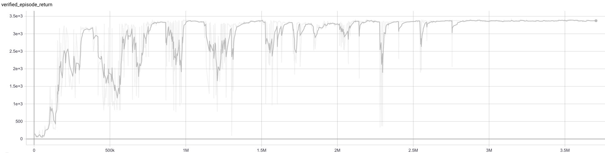
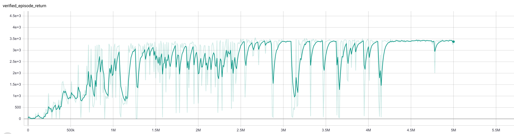
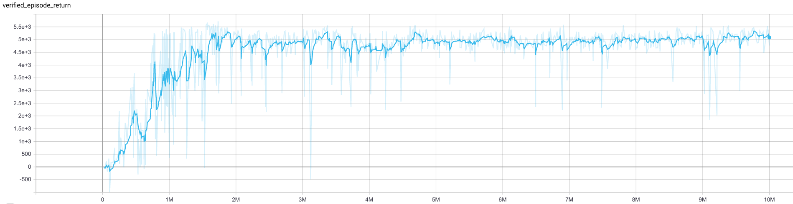
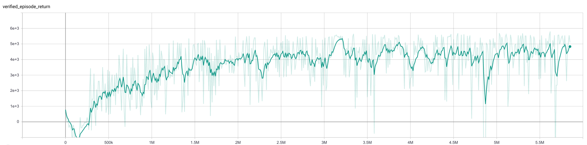
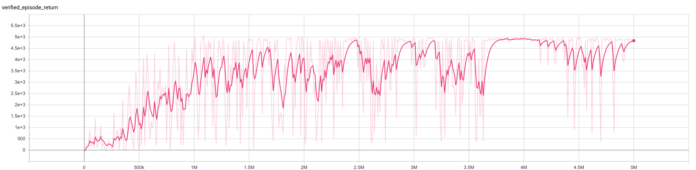
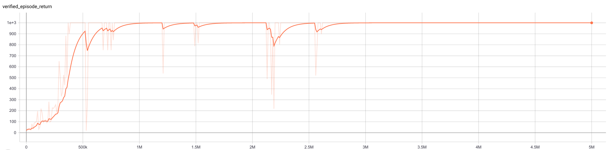
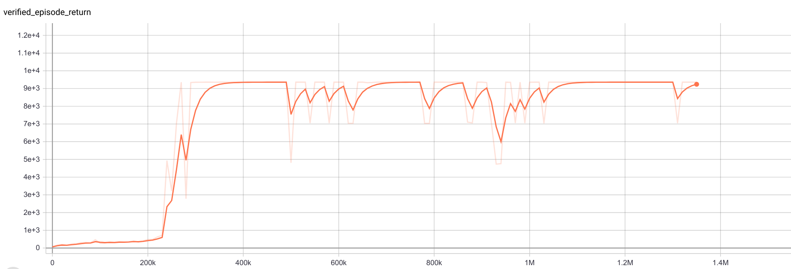

# Description

**This is a GAIL baselines what belong to Inverse Reinforcement Learning (IRL) methods.** 

**As we all know GAN and GAIL are fragile, even the baseline code what is writhed by OpenAI is hard to train. Therefore,  I write a GAIL code which is PyTorch edition. Besides, Because of the fragility of GAIL, I add some trick in code, what is inevitable, and the tricks are as flows:**

# Ｍy_GAIL_PyThorch

## Requirements

- mujoco-py==2.0.2.13
- PyTorch==1.7.1

## Trick:

1. **Memory:** add a replay buffer to train generator, 
2. **Batch Normal:** using batch normal trick to transform  state , action and next state , note: this trick is used for train generator net ，instead of  discriminator net.
3. **Reward Function:** if generator accuracy less than 0.5,  then this indicates that the generator can not identify the generated data and exert data, thus the reward is optimal reward.  Conversely the reward equals to reward function generated by discriminator.
4. **Add noise :** add noise to discriminator

## Note:

1. The key to train GAIL is that balancing the discriminator and generator performance, a strong discriminator is not allowed, the discriminator should waiting for the generator.


# Usage

```bash
python main.py  --env_name=Hopper-v2
```

**note:** By this way, you can only change the ==environment name==, the other parameters  only can be changed in their ==yaml file==, the file path is =="./env_parser/"==.

# Runs


1. **Hopper-v2** (expert ruturn = 3500)






2. **HalfCheetah-v2**(expert ruturn = 6000)
 
 
3. **Ant-v2** (expert ruturn =5500 )

    

4. **Walker2d-v2** (expert ruturn = 4900)



5. InvertedPendulum(1000)

   

6. InvertedDoublePendulum(9359)
   

# Reference

The websites of Four GAIL editions are as flows:

**[SAC]**: 

**[gail-pytorch]**:https://github.com/hcnoh/gail-pytorch.git

**[PyTorch-RL]**:https://github.com/Khrylx/PyTorch-RL.git

**[imitation]**:https://github.com/openai/imitation.git

**[GAIL]**:https://github.com/JiangengDong/GAIL.git

